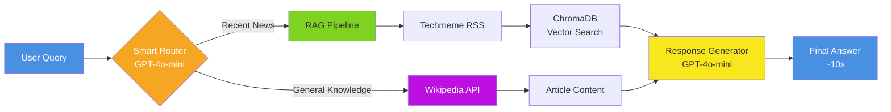

# AI News Analyst

> **An intelligent news analysis system that automatically routes questions to either RAG-powered news search or Wikipedia knowledge base, delivering accurate answers in ~10 seconds with 96% routing accuracy and 9/10 quality scores.**

## Quick Intro

AI News Analyst is a question-answering system that intelligently combines:
- **RAG (Retrieval-Augmented Generation)** for recent tech news from Techmeme
- **Wikipedia Search** for general knowledge and historical information
- **Smart Routing** that automatically determines the best source for your query

Built with LangGraph, ChromaDB, and OpenAI, the system achieves **9/10 relevancy** and **9/10 correctness** while maintaining fast response times.

##  MVP-2  Summary

| Metric | MVP-1 | MVP-2 | Improvement |
|--------|-------|-------|-------------|
| **Relevancy Score** | 6.45/10 | **9.06/10** | **+40%**  |
| **Correctness Score** | 6.1/10 | **8.98/10** | **+47%**  |
| **Routing Accuracy** | 100% | **96%** |  |
| **Avg Response Time** | 12.72s | **10.55s** | **-17%**  |
| **Test Coverage** | 20 examples | **50 examples** |  |

### What Changed

- **RAG Optimization:** Chunk size 100 → 500 characters
  - Larger chunks preserve complete context and sentences
  - Enables accurate, comprehensive LLM responses
  - Better quality AND faster execution

- **Expanded Testing:** 50 diverse test cases across difficulty levels
  - 25 RAG (recent news) + 25 Wikipedia (general knowledge)
  - Structured ground truth with difficulty ratings
  - More edge cases and real-world scenarios

 *For detailed analysis, see [documents/MVP-2.md](documents/MVP-2.md)*

## How It Works

**Flow:** Question → Route (RAG or Wiki) → Retrieve Context → Generate Answer

## Features

- **Smart Routing**: Automatically determines whether to use RAG for recent news or Wikipedia for general knowledge
- **RAG Integration**: Retrieves and analyzes recent news from Techmeme RSS feeds
- **Wikipedia Search**: Accesses general knowledge and historical information
- **Vector Database**: Uses ChromaDB for efficient document storage and retrieval
- **LangGraph Workflow**: Orchestrates the entire analysis process

