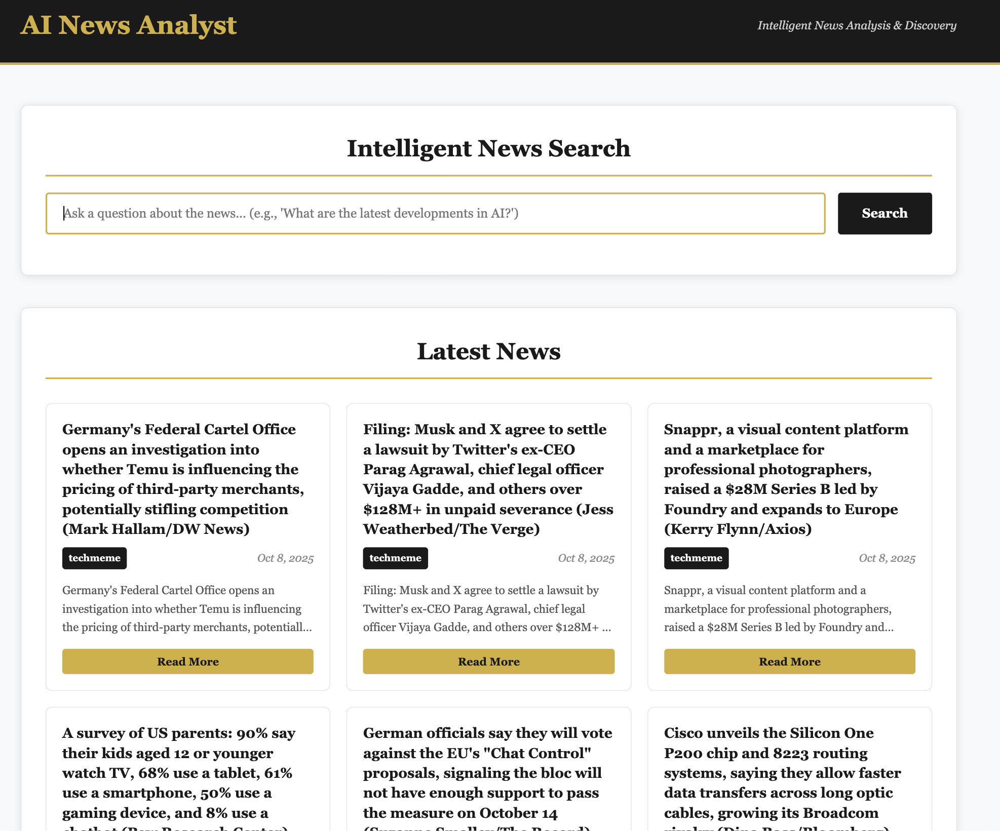
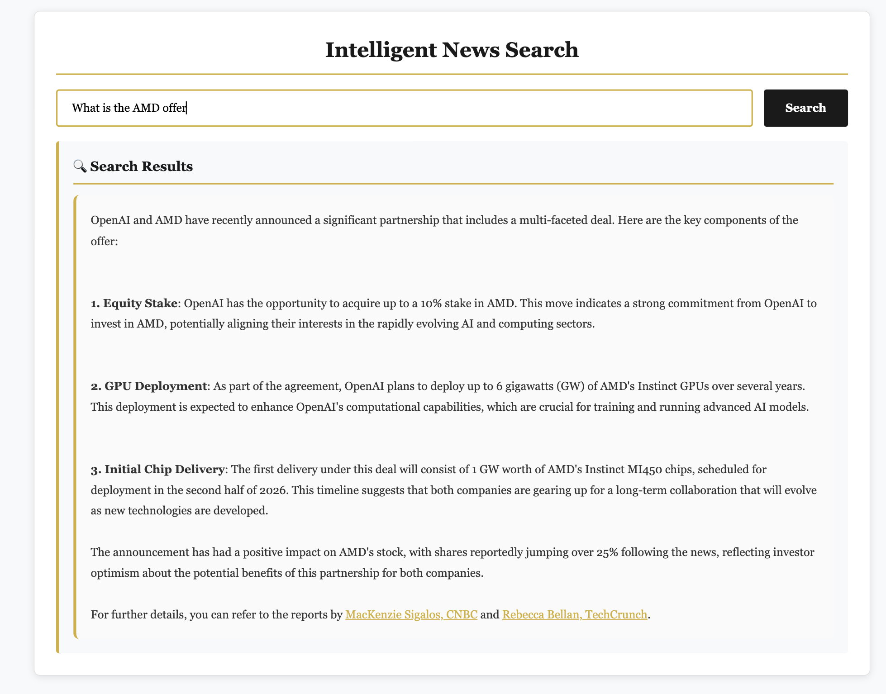
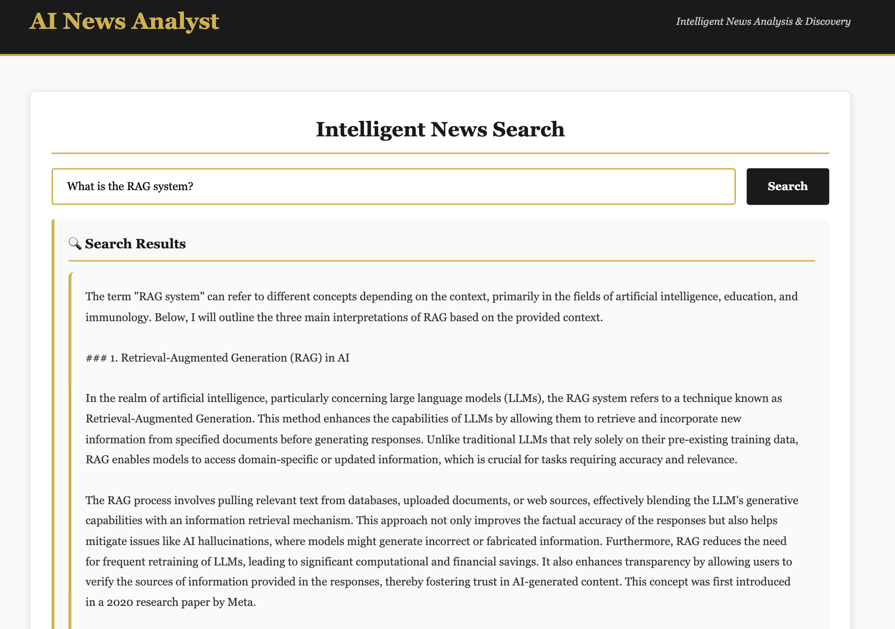
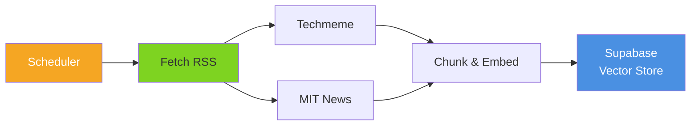
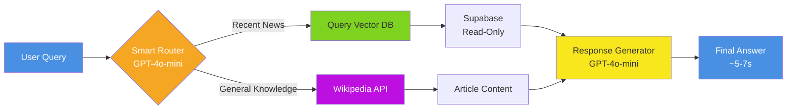

# AI News Analyst

> **An intelligent news analysis system with decoupled architecture that automatically routes questions to either RAG-powered news search or Wikipedia knowledge base, delivering accurate answers in ~5-7 seconds with 96% routing accuracy and 9/10 quality scores.**

## Quick Intro

AI News Analyst is a question-answering system that intelligently combines:
- **RAG (Retrieval-Augmented Generation)** for recent tech news from multiple sources (Techmeme, MIT)
- **Wikipedia Search** for general knowledge and historical information
- **Smart Routing** that automatically determines the best source for your query
- **Background Extraction** that keeps the database updated without affecting query speed

Built with LangGraph, ChromaDB, and OpenAI, the system achieves **9/10 relevancy** and **9/10 correctness** with fast, predictable response times.

### User Interface

*Clean, interactive interface for querying the AI News Analyst*

### RAG-Powered News Search

*Example of RAG-based retrieval from recent tech news sources*

### Wikipedia Knowledge Base

*Example of general knowledge queries routed to Wikipedia*

## MVP-3 Summary (Latest)

**Key Innovation:** Separated extraction from query processing for better performance and scalability.

| Aspect | MVP-2 | MVP-3 | Improvement |
|--------|-------|-------|-------------|
| **Architecture** | Coupled | **Decoupled** |  |
| **Query Time** | 10.55s | **~5-7s (est.)** | **-40%**  |
| **Extraction** | Per query | **Background job** | **Isolated**  |
| **Scalability** | Limited | **High** | **Concurrent**  |

### What Changed in MVP-3

**Architecture Transformation:**
```
BEFORE: User Query → Fetch RSS → Embed → Store → Retrieve → Response
AFTER:  Background: Fetch RSS → Embed → Store (periodic)
        User Query: Retrieve from DB → Response (fast!)
```

**Key Benefits:**
- **Faster queries** - No fetching/embedding overhead during user queries
-  **Better reliability** - RSS failures don't block user queries
-  **Rich metadata** - Track sources, dates, and ingestion times
-  **Scalable** - Handle multiple concurrent queries efficiently

*For detailed analysis, see [docs/MVP-3.md](documents/MVP-3.md)*

##  MVP-2  Summary

| Metric | MVP-1 | MVP-2 | Improvement |
|--------|-------|-------|-------------|
| **Relevancy Score** | 6.45/10 | **9.06/10** | **+40%**  |
| **Correctness Score** | 6.1/10 | **8.98/10** | **+47%**  |
| **Routing Accuracy** | 100% | **96%** |  |
| **Avg Response Time** | 12.72s | **10.55s** | **-17%**  |
| **Test Coverage** | 20 examples | **50 examples** |  |

### What Changed

- **RAG Optimization:** Chunk size 100 → 500 characters
  - Larger chunks preserve complete context and sentences
  - Enables accurate, comprehensive LLM responses
  - Better quality AND faster execution

- **Expanded Testing:** 50 diverse test cases across difficulty levels
  - 25 RAG (recent news) + 25 Wikipedia (general knowledge)
  - Structured ground truth with difficulty ratings
  - More edge cases and real-world scenarios

 *For detailed analysis, see [docs/MVP-2.md](documents/MVP-2.md)*


## How It Works (MVP-3 Architecture)

### Background Extraction (Runs Periodically)


### User Query (Real-Time)


**Background Flow:** Scheduler → Fetch → Embed → Store  
**Query Flow:** Question → Route → Query DB → Generate Answer

## Features

- **Smart Routing**: Automatically determines whether to use RAG for recent news or Wikipedia for general knowledge
- **Background Extraction**: Periodic job fetches and processes news independently from queries
- **Multi-Source RAG**: Retrieves from Techmeme and MIT News with source attribution
- **Wikipedia Search**: Accesses general knowledge and historical information
- **Vector Database**: Supabase with pgvector for scalable document storage and retrieval
- **LangGraph Workflow**: Orchestrates the query processing workflow
- **Scheduled Updates**: Configurable extraction intervals (hourly, custom, or on-demand)
- **Global Token Limiting**: Built-in daily token limits (5000 tokens/day) for cost control
- **Production Ready**: Docker support, health checks, and cloud deployment configs

# Force Railway redeploy
